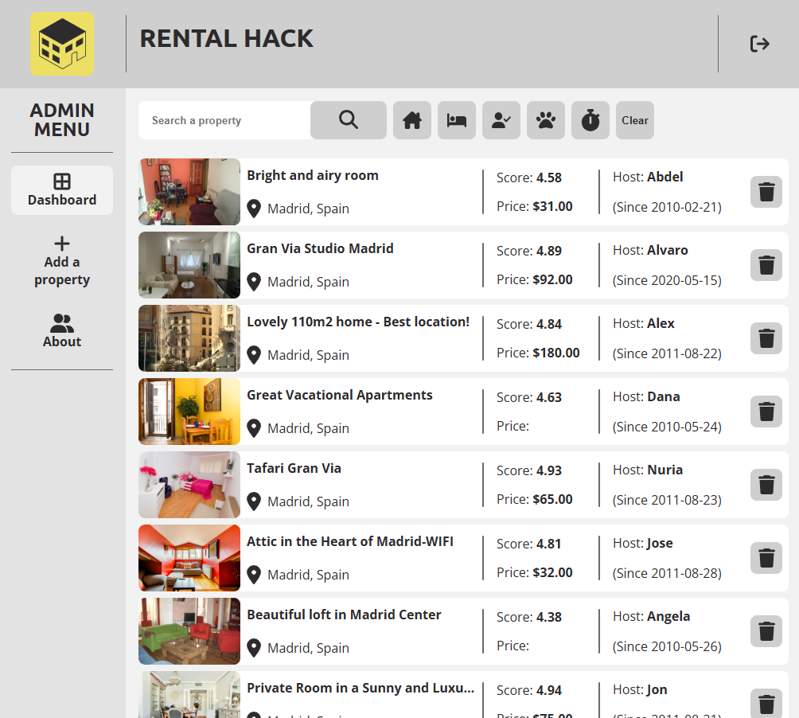

# Rental Hack - An Ironhack Apartment Rentals Admin

This is one of our projects in the [Ironhack](https://www.ironhack.com/fr-en/web-development/paris) journey.

## Table of contents

- [Overview](#overview)
  - [Screenshot](#screenshot)
  - [Context](#context)
  - [The challenge](#the-challenge)
  - [Deliverable Expected](#deliverable-expected)
  - [Links](#links)
- [Author](#author)
  - [Jennifer MERAT](#jennifer-merat)
  - [Ronan CANNY](#ronan-canny)
- [React + Vite](#react-+-vite)
- [Expanding the ESLint configuration](#expanding-the-eslint-configuration)

## Overview

### Screenshot

### Context

Ironhack has been training talent since 2013. With 7 campuses worldwide plus remote flexibility, more than 1,000 global hiring shares and over 12,500 student graduates; Ironhack trains in web development, web design, data analysis and cyber security. A single philosophy: “Learn by doing”. ironhack aims to have his learning experiences translated into real life experiences. [The aim of the web development bootcamp](https://www.ironhack.com/fr-en/web-development/paris) is to become a MERN Full-Stack developer (Mongo, Express, React, Node) via an intensive 3-module training program. 
- Module 1: Building Web development fundamentals and javascript mastery, validated by the creation of a game to run in the browser.
- Module 2: Improving your front-end skills with React integration, validated by the creation of an SPA capable of interacting with an external API.
Module 3: Building backend skills and advances full-stack development, validated by the development of a full web application as a final project using the MERN stack, simulating the real-life collaboration found in technology companies with the application of agile methodology and best practices.

### The challenge

The challenge is to build an Admin dashboard for the apartment rental platform where the admin can see and manage the apartments shown on the platform with React + Vite

### Deliverable Expected

Your React application must meet the technical requirements and have the features listed below:

Create a React application that has the following features:
- It should be an app made for a single user.
- Navbar - A component that displays the name and the logo of the app, shown on all the pages.
- Footer - A component that displays a link to the GitHub repo of the project, shown on all the pages.
- Sidebar - A sidebar component shown on all the pages. The component should display links to pages added to the app at a later stage.
- Items List - A list of items showing the JSON data.
- Conditional Rendering - Conditionally render content using boolean properties from the project’s JSON data.
- Delete Items - A button on each list item that allows the user to delete the item from the list.
- Item Details Page - A page showing the details of the selected item from the list of items.
- About Page - A page showing the project description and information about the team members (students) working on the project,         including links to their GitHub and LinkedIn profiles.
- Not Found Page - A page shown whenever the user navigates to a URL route that doesn’t exist in the app.
- Create Item Form - A form that allows the user to create a new item and add it to the items list.
- Update Item Form - A form that allows the user to update an existing item on the list.

### Links

- Solution Repository URL: [Click here](https://github.com/refinejcode49/lab-apartment-rental-admin)
- Slides Presentation URL: [Click here](https://www.canva.com/design/DAGiMy-hJIw/FhuRLqt3YbERsc0EijKDhA/edit)

## Authors

### Jennifer MERAT

- GitHub - [@refinejcode49](https://github.com/refinejcode49/)

### Ronan CANNY

- GitHub - [@CannyRo](https://github.com/CannyRo)

## React + Vite

This template provides a minimal setup to get React working in Vite with HMR and some ESLint rules.

Currently, two official plugins are available:

- [@vitejs/plugin-react](https://github.com/vitejs/vite-plugin-react/blob/main/packages/plugin-react/README.md) uses [Babel](https://babeljs.io/) for Fast Refresh
- [@vitejs/plugin-react-swc](https://github.com/vitejs/vite-plugin-react-swc) uses [SWC](https://swc.rs/) for Fast Refresh

## Expanding the ESLint configuration

If you are developing a production application, we recommend using TypeScript and enable type-aware lint rules. Check out the [TS template](https://github.com/vitejs/vite/tree/main/packages/create-vite/template-react-ts) to integrate TypeScript and [`typescript-eslint`](https://typescript-eslint.io) in your project.
